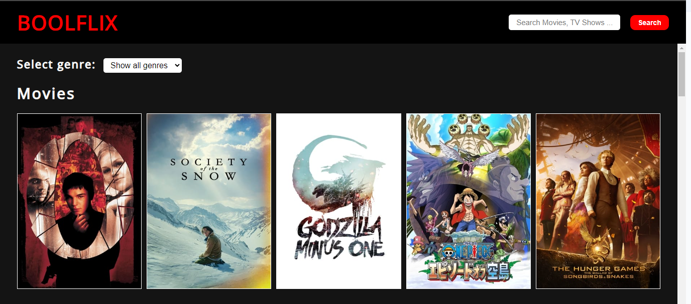

# BoolFlix

## Step per provare il progetto

Da terminale lanciare i seguenti comandi:

```
npm install
npm run dev
```

## Descrizione

In questo progetto viene replicato un sito per la visione di film e serie TV, che vengono mostrati sotto forma di card con un immagine e passando col mouse sopra una di queste vengono mostrate ulteriori informazioni.
Entrando sulla pagina vengono mostrati film e serie tv più popolari, è poi possibile effettuare una ricerca per titolo del film(con un input di testo e un pulsante) e una volta ottenuto il risultato è disponibile un filtro per genere(con una select).

## Tecnologie utilizzate

1. HTML/CSS: per la creazione delle strutture dei varie componenti e la gestione del loro stile
2. SASS: importato come pacchetto per scrivere lo stile delle pagine in modo più semplice
3. FONTAWESOME: importato come pacchetto per eventuali icone, ad esempio nelle info di ogni film il voto è mostrato come stelline anzichè come voto numero
4. AXIOS: importato come pacchetto per gestire le chiamate API delle serie e dei film che ci permettono di ottenere i dati da mostrare in pagina
5. FLAG-ICONS: importato come pacchetto al fine di mostrare la lingua del film come bandiera e non solo come lettere(IT, EN, FR etc..)
6. VUEJS + VITE: per la creazione del template del nostro progetto e dei vari componenti, per la gestione dei pacchetti importati e per gestire la reattività della nostra pagina

### Immagine del progetto finale


